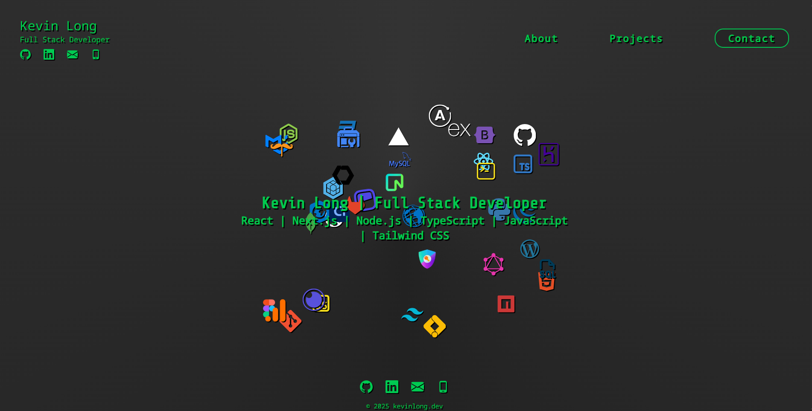

# [www.kevinlong.dev](https://www.kevinlong.dev)

This is the source code for my personal portfolio website, showcasing my projects, skills, and experience as a full stack developer. The website is built with Next.js and deployed on Vercel.

## Technologies Used

- [Next.js](https://nextjs.org/)
- [Vercel](https://vercel.com/)
- [TypeScript](https://www.typescriptlang.org/)
- [Tailwind CSS](https://tailwindcss.com/)
- [React](https://reactjs.org/)
- [Embla Carousel](https://www.embla-carousel.com/)
- [EmailJS](https://www.emailjs.com/)
- [Vercel Analytics](https://vercel.com/docs/analytics)

## Features

- Responsive design for optimal viewing on all devices
- Interactive project showcase with carousel functionality
- Contact form integrated with EmailJS for easy communication
- Vercel analytics for performance monitoring

## Screenshots

## Contact

Feel free to reach out to me via the contact form on the website or by email at [kevinlong.dev@gmail.com](mailto:kevinlong.dev@gmail.com).
